[[_TOC_]]
#RPC
- A remote procedure call is an inter-process communication technique that is used for client-server-based applications.
It is also known as a subroutine call or a function call.
- RPC – Remote Procedure call is a protocol to enable communication in distributed System.
- RPC uses the Client/Server model.

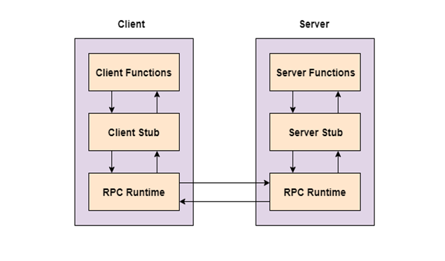

#GRPC
- gRPC is a modern open-source high performance Remote Procedure Call (RPC) framework.
- Simple Service definition using protocol buffer.
- Works across language and platform.
- Bi-directional streaming and fully integrated pluggable authentication with HTTP/2-based transport.

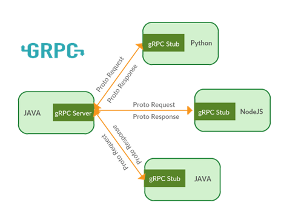

#ProtoBuf – Protocol Buffers:
- Protocol buffers are Google's language-neutral, platform-neutral, extensible mechanism for serializing structured data
- Extension .proto.
- By default gRPC uses protocol buffers as both its Interface Definition Language (IDL) and as its underlying message interchange format.
- Message format and gRPC service can be defined in protocol buffer.
- It supports generated code in
	- Python
	- C++
	- C#
	- Objective – C
	- Kotlin
	- Dart
	- Go
	- Ruby

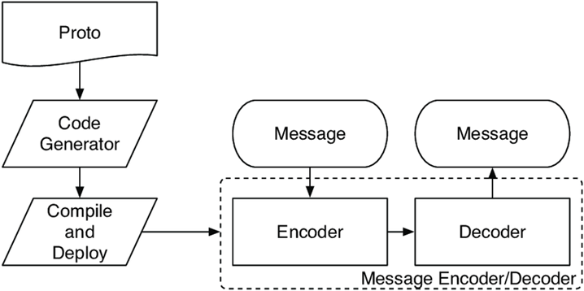

#Test Execution using GRPC
Remote Test Execution can be enabled with the help of GRPC, below are the steps to implement GRPC based remote test execution.

##Env Setup
- Install the following to make the environment ready
- Python 3.5 or higher
- Pip version 9.0.1 or higher
- Python -m pip install –upgrade pip
- Python -m pip install grpcio
- Python -m pip install grpcio
- Python -m pip install grpcio - tools

##Work flow

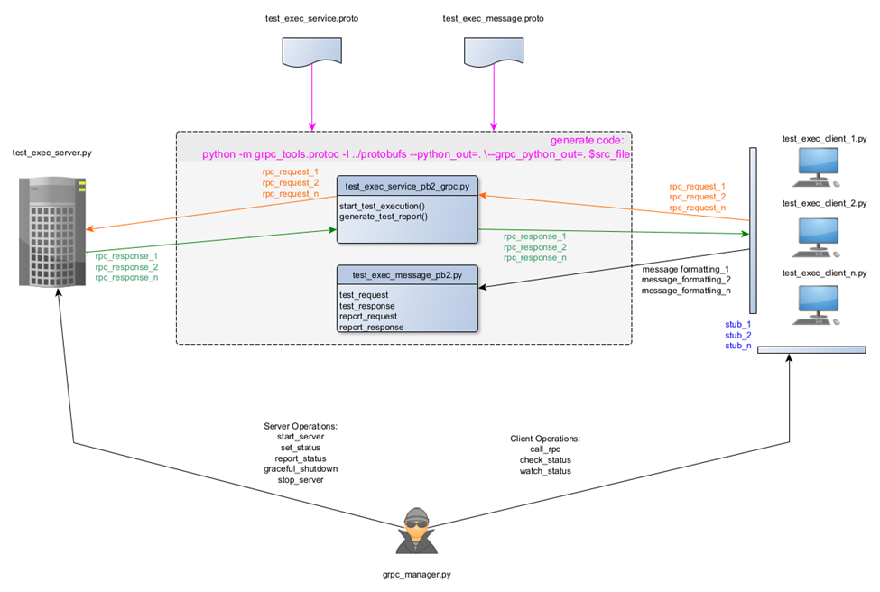

##protobuf
###test_exec_message.proto
message exchange format for test execution are defined in .proto file as shown below

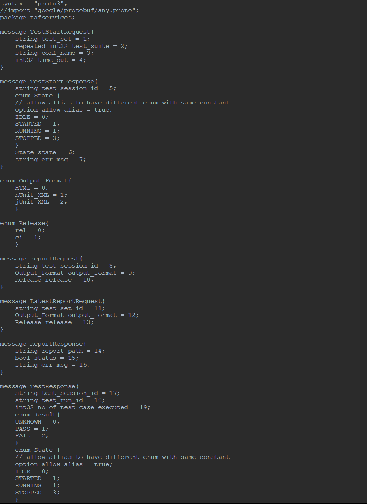

###test_exec_service.proto
Services for test execution are defined in **.proto** file as shown below
Test_exec_message.proto is imported to use the message exchange format

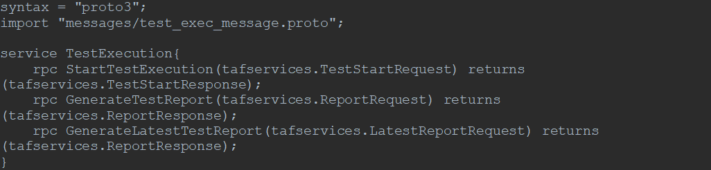

**generate .py files from protobuf:**

Now, to generate Python code from the protobufs, run the following:

**python -m grpc_tools.protoc  -I.  --python_out=. --grpc_python_out=. test_exec_message.proto**

**python -m grpc_tools.protoc  -I.  --python_out=. --grpc_python_out=. test_exec_service.proto**

**generated files**

**test_exec_message_pb2.py :** file that was generated for you contains the type definitions.

**test_exec_service_pb2_grpc.py :** file contains the framework for a client and a server

##Server Implementation and Use cases:
###Create server : 
Below part shows the way GRPC serves

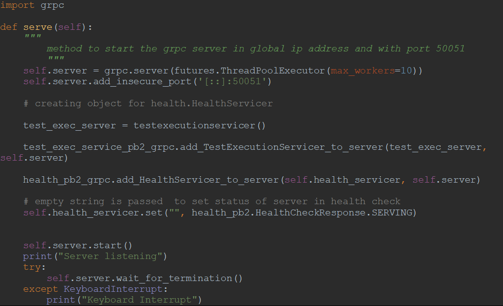

###Implement Service :
Service defined in the **.proto** file will be implemented in the server, **test_exec_server.py**

Service from **.proto** file will be interfaced in the generated file, actual implementation of the service will be implemented in the server by inheriting specific class

Below code displays the service interfaced in generated file  **test_exec_service_pb2_grpc.py**

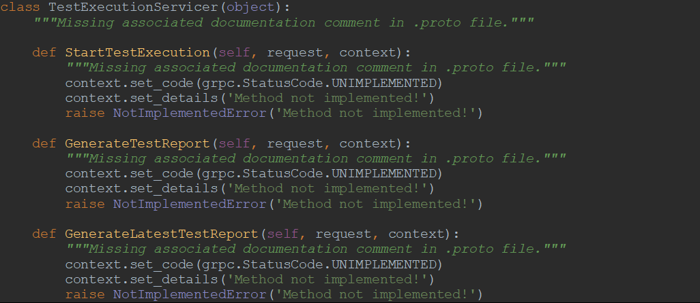

Below is the implementation for the above service in **test_exec_server.py**

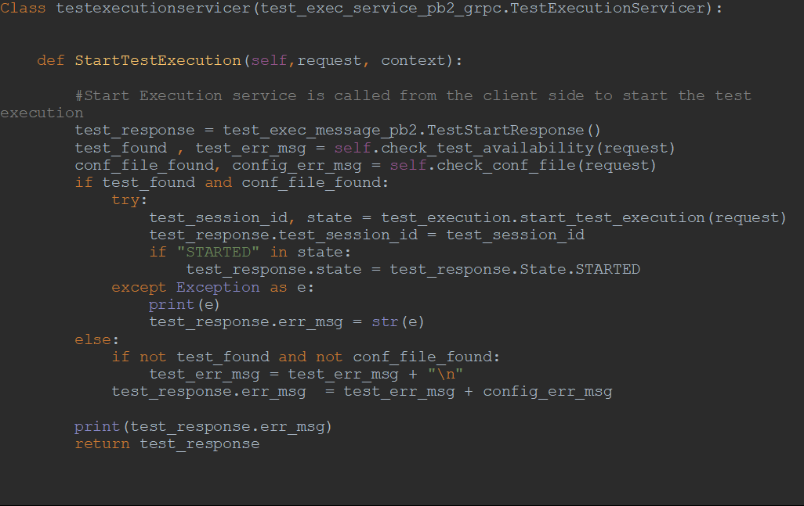

###Server use cases:
Below are the server side use cases

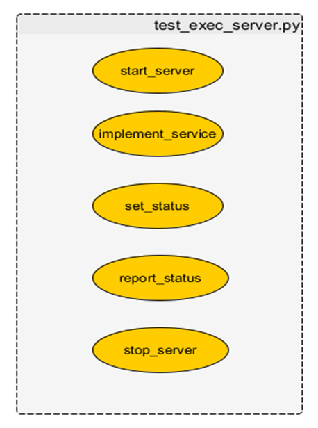

##Client Implementation and Use cases:
Service defined in the **.proto** file will be called from the client file **test_exec_client.py**

Channel will be created in client to establish communication with local/remote server

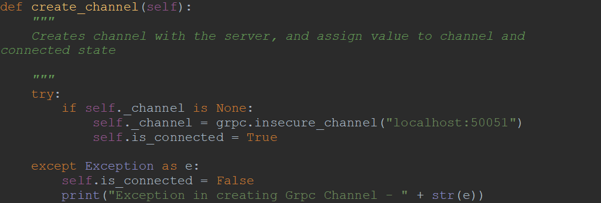

stub is created to call the service implemented in server

service will be called from the client side using the stub

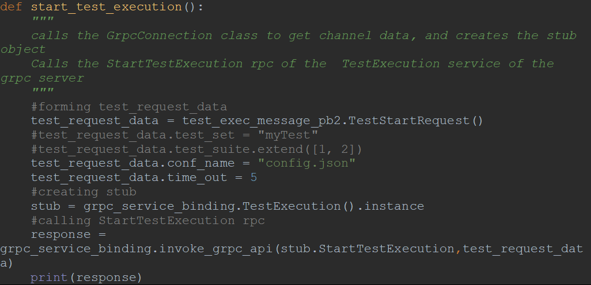

###Client Use Cases:

##Control from external world: grpc_manager.py
Server side and client side use case can be controlled from the external world
###Server_side_control

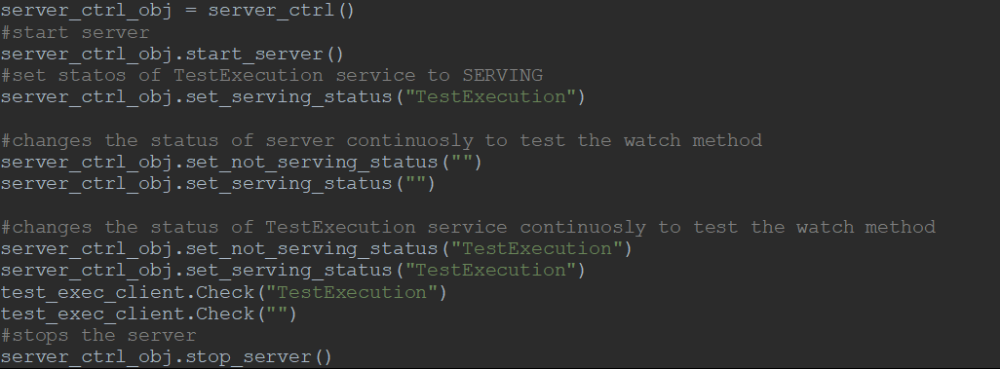

###CLient_side_control

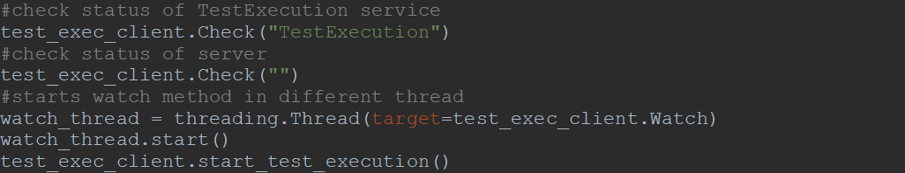

