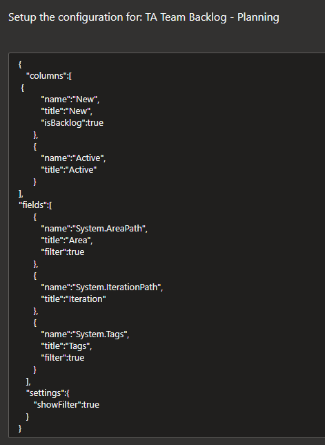
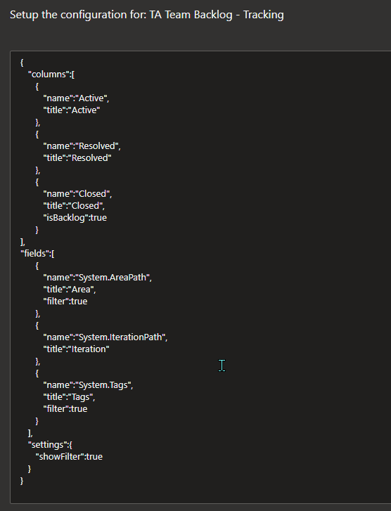

[[_TOC_]]

## Orion Test Automation Tracking - Query based boards
- Created a query ‘TA Team Backlog – Planning’ under **Shared Queries>Orion>Testing>Test Automation**
  - [TA Team Backlog - Planning - Boards](https://dev.azure.com/AnaChem/AnaChemProjects/_queries/query/3d2c3314-f367-4a9e-8a31-80e8e7399cf6/)
- Query filters the work item types ‘Epic’ and ‘Feature’ under the Area path **‘AnaChemProjects\G5\Titration\KF\SW\Orion\TestAutomation’** of any state and their direct linked work items of type ‘Backlog Item’.
- Go to the setting **‘Query Based Boards’** under **‘Project Settings’**.
- Select the Query **‘TA Team Backlog – Planning’** under ‘Query Based Boards – Configuration’ (Query can be identified with the name or ID).
- Enter the below configuration in the configuration field and ‘Save’.

- Once you saved the configuration, go to Query **‘TA Team Backlog – Planning’** and select the tab **‘Show as Taskboard’**.
  - [TA Planning board](https://dev.azure.com/AnaChem/AnaChemProjects/_queries/realdolmen.EdTro-AzureDevOps-Extensions-QueryBasedBoards-Public.EdTro-AzureDevOps-Extensions-QueryBasedBoards.BoardTab/3d2c3314-f367-4a9e-8a31-80e8e7399cf6/)
- It displays the board with columns **‘New’** and **‘Active’** for the backlogs under the Feature or Epic filtered with the query.

## Orion Test Automation Tracking - Query based boards
- Created a query **‘TA Team Backlog – Tracking**’ under **Shared Queries>Orion>Testing>Test Automation**.
  - [TA Team Backlog - Tracking - Boards](https://dev.azure.com/AnaChem/AnaChemProjects/_queries/query/c3953243-ec5f-462a-8608-a5232c38e36c/)
- Query filters the work item types ‘Epic’ and ‘Feature’ under the Area path **‘AnaChemProjects\G5\Titration\KF\SW\Orion\TestAutomation’** of any state and their direct linked work items of type **‘Backlog Item’** with current iteration of project Orion in iteration path.
- Go to the setting **‘Query Based Boards’** under **‘Project Settings’**.
- Select the Query **‘TA Team Backlog - Tracking’** under ‘Query Based Boards – Configuration’ (Query can be identified with the name or ID).
- Enter the below configuration in the configuration field and ‘Save’.

- Once you saved the configuration, go to Query **‘TA Team Backlog - Tracking’** and select the tab **‘Show as Taskboard’**.
  - [TA Tracking board](https://dev.azure.com/AnaChem/AnaChemProjects/_queries/realdolmen.EdTro-AzureDevOps-Extensions-QueryBasedBoards-Public.EdTro-AzureDevOps-Extensions-QueryBasedBoards.BoardTab/c3953243-ec5f-462a-8608-a5232c38e36c/)
- It displays the board with columns **‘Active’**, **‘Resolved’** and **‘Closed’** for the backlogs under the Feature or Epic filtered with the query.
